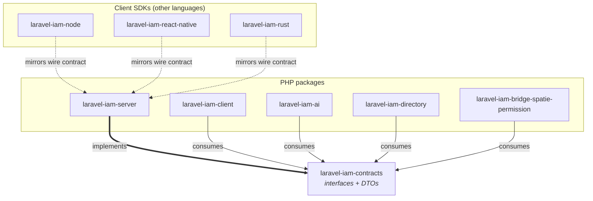
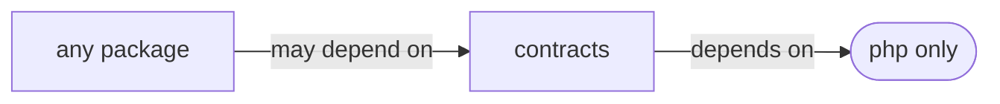

# Ecosystem & dependencies

This page is the map. It shows **who implements** each contract, **who consumes** it, and why the
dependency graph is shaped the way it is. Every other reference page documents one corner of this map.

## The dependency graph



- **Solid bold arrow (`implements`)** — `laravel-iam-server` provides concrete classes for the interfaces.
- **Solid arrows (`consumes`)** — PHP packages depend on the contracts and type against them.
- **Dotted arrows (`mirrors wire contract`)** — the SDKs are written in Node/TS, React Native and Rust, so
  they cannot depend on a PHP package; instead they mirror the **HTTP wire contract** the server exposes.

## Who implements what

The server is the home of the concrete implementations. Each interface in this package has (at least) one
implementor there:

| Contract (port) | Implemented by (in `laravel-iam-server`) | Future / alternative adapters |
| --- | --- | --- |
| [`AuthorizationEngine`](/reference/authorization) | `NativeSqlEngine` (RBAC+ABAC+ReBAC over SQL) | OpenFGA / SpiceDB (Zanzibar scale) |
| [`KeyProvider`](/reference/crypto) | `LocalKeyProvider` | `AwsKmsKeyProvider`, Vault/Azure/GCP/HSM |
| [`SecretCipher`](/reference/crypto) | envelope cipher over a `KeyProvider` | — |
| [`TokenSigner`](/reference/crypto) | ES256 signer + JWKS rotation | — |
| [`AssuranceProvider`](/reference/assurance) | native AAL-from-session | richer trust-scoring adapter |
| [`StepUpProvider`](/reference/assurance) | native step-up | external SCA |
| [`FactorVerifier`](/reference/assurance) | Fortify / laravel-passkeys binding | external SCA provider |
| [`FeatureScope`](/reference/governance) | native cascade resolver | — |
| [`SessionRegistry`](/reference/identity) | DB-backed registry | — |

## Who consumes what

| Consumer | Consumes | How |
| --- | --- | --- |
| `laravel-iam-client` | `SubjectRef`, decision shapes, `Aal` | types incoming claims and Gate decisions against the contracts |
| `laravel-iam-ai` | `SubjectRef`, `FeatureScope` | advisory governance gated by feature scopes |
| `laravel-iam-directory` | `SubjectRef` | maps LDAP/AD principals to subject refs |
| `laravel-iam-bridge-spatie-permission` | `AuthorizationEngine`, `SubjectRef` | diffs spatie decisions against the PDP in shadow mode |
| Node / React Native / Rust SDKs | the **wire** equivalent | mirror the server's decision JSON, not the PHP types |

## The wire contract (for the SDKs)

The SDKs don't import this package — they speak HTTP. The real decision endpoint is the **slash** form:

```text
POST {base}/api/iam/v1/decisions/check
POST {base}/api/iam/v1/decisions/list-resources
```

The server wraps responses in a `{ "data": { … } }` envelope. All SDKs and the PHP client are aligned to
this shape. The PHP `AuthorizationEngine::check()` return value is the in-process equivalent of that wire
`data` object — which is exactly why its signature is currently `array<string, mixed>` (see
[ADR](/architecture/decisions)).

## Why the contracts package is the sink



The contracts package has **out-degree zero** in the package graph — it depends only on the PHP runtime.
That single property guarantees:

- **no dependency cycles** can form through it;
- it can be **released without rebuilding** anything;
- consumers **never inherit a framework** by depending on it.

See [Why a contracts-only package](/concepts/why-contracts) for the formal argument and
[Versioning & ABI stability](/architecture/versioning) for how it evolves without breaking the graph.

## Related

- [Contract reference overview](/reference/overview) — the namespace map.
- [Ports & adapters](/concepts/ports-and-adapters) — the pattern this graph realises.
