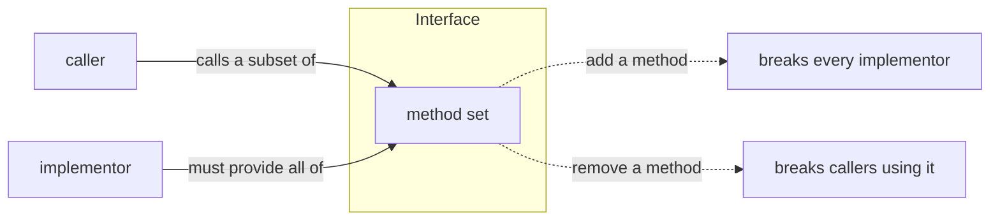

# Versioning & ABI stability

Because every other package in the ecosystem depends on these symbols, the rules for changing them are
stricter than for an ordinary library. This page defines **what is breaking**, **how the package evolves**,
and **how to pin it**.

## Motivation

In a normal library, "breaking change" usually means *callers* must adapt. In a **contracts** package there
is a second, harsher audience: **implementors**. Adding a method to an interface breaks every class that
implements it — even though no caller changed. The package therefore has to reason about both directions of
the contract.

## Theory — the two directions of a contract

An interface is a contract with two parties:

| Party | Sees the interface as | Broken by |
| --- | --- | --- |
| **Caller / consumer** | a set of methods it may call | removing a method, narrowing a return type, widening a parameter type |
| **Implementor / adapter** | a set of methods it must provide | **adding** a method, widening a return type, narrowing a parameter type |

A change is **safe** only if it breaks *neither* party. For a contracts package that ships interfaces meant
to be implemented, the binding constraint is almost always the implementor side — which is why even
"harmless-looking" additions are major.



## What is a breaking change here

| Change | Breaking? | Why |
| --- | --- | --- |
| Add a method to an interface | **Yes (major)** | every implementor must now provide it |
| Remove / rename a method | **Yes (major)** | callers and implementors both break |
| Change a method's parameter or return type | **Yes (major)** | variance breaks one side |
| Add a **new** interface | No (minor) | nothing implements it yet |
| Add a new enum **case** | Usually minor* | breaks exhaustive `match` without a default |
| Add an optional, defaulted constructor param to a DTO | Minor | existing constructions still compile |
| Tighten documentation of an existing default | No (patch) | behaviour-preserving clarification |

::: callout info "On enum growth (*)" icon:info
A new `FeatureKey` / `ScopeLevel` / `Aal` case is additive, but consumers using an exhaustive `match` with
no `default` arm will fail to compile until they handle it — treat enum growth as a documented,
release-noted change.
:::

## The evolution rule: add, don't mutate

> **Evolve by adding new interfaces and new enum cases. Do not mutate a published interface.**

When a contract genuinely must grow:

::: steps
1. **Prefer a new interface.** Ship `AuthorizationEngineV2` (or a focused capability interface) alongside
   the existing one and let implementors opt in, rather than adding a method to `AuthorizationEngine`.

2. **If you must change a signature, bump the major.** Coordinate the release with the server (the
   implementor) and document the migration. Where possible make it **additive** — e.g. introduce the typed
   `DecisionQuery` / `Decision` (see [ADR-002](/architecture/decisions)) as a new typed path rather than
   replacing the `array` one in place.

3. **Announce enum growth.** A new `FeatureKey` or `Aal` case ships in the release notes so consumers using
   exhaustive `match` add the arm deliberately.
:::

## Worked example — hardening `check()` without a flag day

[ADR-002](/architecture/decisions) ships `AuthorizationEngine::check(array $query): array` today. The
intended future is typed `DecisionQuery` / `Decision`. The additive path:

- introduce `DecisionQuery` and `Decision` as new value objects (minor — new classes);
- in the **major** that adopts them, change `check()` to accept/return the typed objects, releasing the
  contracts package and `laravel-iam-server` together;
- because the array shape was deliberately isomorphic to the wire JSON, the typed objects are a
  re-packaging of the same data — no semantic migration for the SDKs, which keep speaking the wire form.

## How to pin it

::: tabs
== tab "Implementors (e.g. the server)"
Pin to a **major** so a new required method never appears under you silently:

```json
{
  "require": {
    "padosoft/laravel-iam-contracts": "^1.0"
  }
}
```
== tab "Consumers (apps, modules)"
Same caret pin; you receive new interfaces and enum cases as minors and only adapt at a major:

```json
{
  "require": {
    "padosoft/laravel-iam-contracts": "^1.0"
  }
}
```
== tab "SDKs (Node / RN / Rust)"
The SDKs do **not** depend on this Composer package — they pin to the **server's wire contract version**
(`/api/iam/v1/...`). The `v1` in the path is the stability boundary they track.
:::

## Gotchas

::: callout warning "Silent ecosystem breakage" icon:alert-triangle
- **Adding one method here breaks the server's build** until it implements it. Treat every interface change
  as a cross-repo, coordinated, major release.
- **A new enum case** can break an exhaustive `match` in a consumer with no `default`. Ship it in release
  notes, not quietly.
- **Don't sneak behaviour into a "patch".** Changing what `active()` or `fromString(null)` returns is a
  semantic break even if the signature is identical — those defaults are part of the
  [fail-closed contract](/concepts/fail-closed).
:::

## Related

- [Architecture decisions](/architecture/decisions) — the trade-offs being versioned.
- [Why a contracts-only package](/concepts/why-contracts) — why stability matters this much here.
