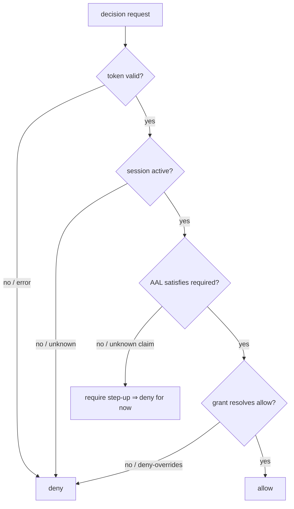

# Fail-closed by design

Laravel IAM is **fail-closed**: default-deny, deny-overrides, and any error (transport, PDP, parsing)
resolves to *deny* — never an allow, never an opaque 500. The contracts encode that ethos directly in their
**signatures and documented defaults**, so an implementor that falls back to the safe value is automatically
correct.

## Motivation

Security defaults are the ones that survive bugs. If the "I don't know" branch of your code returns *allow*,
then every gap — an unparsed token, a missing grant, a dropped connection — becomes a privilege escalation.
Fail-closed flips that: the default branch is the **least-privileged** one, so a gap degrades into a denial,
which is visible and safe rather than silent and dangerous.

## The principle

> **When in doubt, deny. Unknown maps to the weakest level, not the strongest.**

The contracts apply this in three places where the type system can carry the guarantee.

### 1. Sessions: `active()` is fail-closed

```php
/** True if the session exists, is not revoked and is not expired (idle/absolute). Fail-closed. */
public function active(string $sessionId): bool;
```

The documented contract is that `active()` returns `true` **only** when it can positively confirm the
session is live. An unknown id, a store error, an expired idle/absolute window — all return `false`. A
consumer that treats `false` as "deny access" is correct by default. See
[`SessionRegistry`](/reference/identity).

### 2. Assurance: unknown maps to the weakest level

```php
public static function fromString(?string $value): self
{
    return self::tryFrom($value ?? '') ?? self::AAL1;
}
```

`Aal::fromString(null)` returns `AAL1` — the **weakest** level — not `AAL3`. A missing or malformed
assurance claim therefore *fails the step-up check* rather than satisfying it:

```php
Aal::fromString($claims['aal'] ?? null)->satisfies(Aal::AAL2);
// unknown claim ⇒ AAL1 ⇒ does NOT satisfy AAL2 ⇒ step-up required
```

Likewise `AssuranceProvider::currentAal()` is documented to return `AAL1` when the session is **not
active** — the safe floor. See [`Aal` and `AssuranceProvider`](/reference/assurance).

### 3. Authorization: deny-overrides, never fail-open

`AuthorizationEngine::check()` must return a **deterministic** allow/deny decision and **never fail-open**.
The native engine combines grants with a **deny-overrides** algorithm: if any applicable rule denies, the
decision is deny, regardless of how many allow. An engine that cannot reach a positive allow returns deny.

```php
public function check(array $query): array
{
    // deterministic, deny-overrides; never fail-open
    return ['decision' => 'deny', 'reason' => 'no_matching_grant'];
}
```

## Design — where "deny" comes from



Every diamond's failure edge points at **deny**. There is no path where "I couldn't tell" ends in *allow*.

## Worked example — a fail-closed guard

```php
use Padosoft\Iam\Contracts\Identity\SessionRegistry;
use Padosoft\Iam\Contracts\Assurance\Aal;

function guard(SessionRegistry $sessions, ?string $sid, ?string $aalClaim): bool
{
    // Unknown / missing sid ⇒ active() is false ⇒ deny.
    if ($sid === null || ! $sessions->active($sid)) {
        return false;
    }

    // Unknown / missing claim ⇒ AAL1 ⇒ fails an AAL2 requirement ⇒ deny.
    return Aal::fromString($aalClaim)->satisfies(Aal::AAL2);
}
```

Every missing input collapses to `false`. You did not have to write the deny branches — the contracts'
defaults wrote them for you.

## Gotchas

::: callout warning "Don't undo the default" icon:alert-triangle
- **Never coalesce to the strong value.** `Aal::fromString($x) ?: Aal::AAL3` re-introduces fail-open.
  Trust the built-in `?? self::AAL1`.
- **Don't catch-and-allow.** Wrapping `check()` in a `try { } catch { return allow; }` defeats the entire
  model. On error, deny.
- **`active()` must not throw "true".** If your store is unreachable, return `false`, don't optimistically
  assume the session is live.
:::

## Related

- [Identity reference](/reference/identity) — `SessionRegistry::active()` in full.
- [Assurance reference](/reference/assurance) — `Aal`, `fromString`, `satisfies`.
- [Why a contracts-only package](/concepts/why-contracts) — why the defaults live in signatures.
