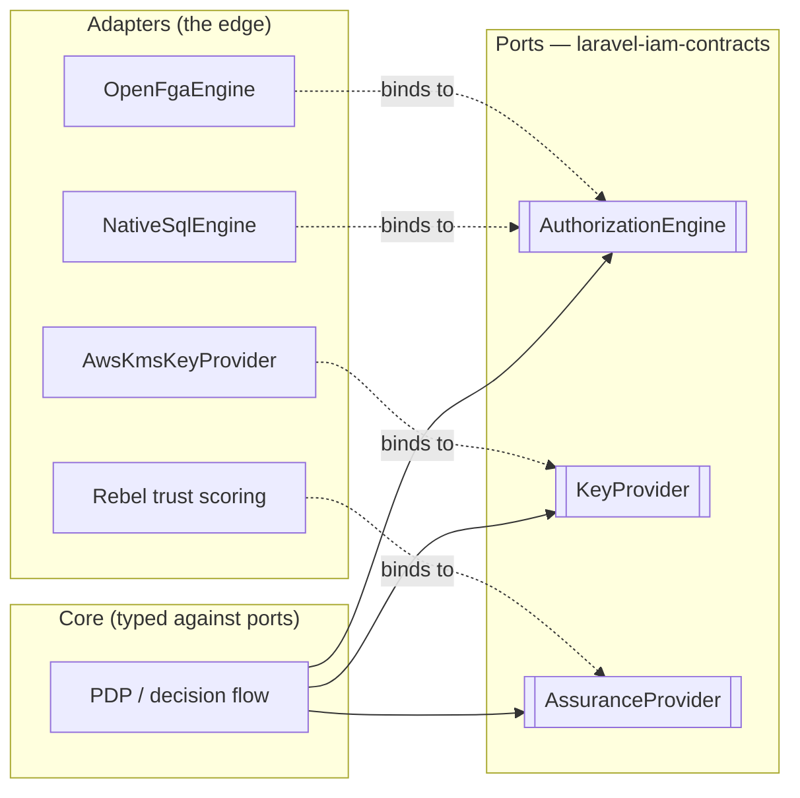

# Ports & adapters

The contracts package is the **ports** half of a *ports & adapters* (hexagonal) architecture. This page
gives you the mental model so the rest of the reference reads as one coherent design rather than a bag of
interfaces.

## Motivation

When an application talks to the outside world — a database, a key store, an authenticator — you want the
*core* of the system to be written in terms of **what it needs**, not **how it is provided**. A port is the
"what"; an adapter is the "how". Keeping them separate is what lets you test the core in isolation and swap
the outside without rewriting the inside.

## The model

> **A port is an interface the core owns. An adapter is an implementation the edge provides.**

In Laravel IAM:

| Hexagonal term | In this ecosystem |
| --- | --- |
| **Port** | An interface in `laravel-iam-contracts` (`AuthorizationEngine`, `KeyProvider`, …) |
| **Driven adapter** | A concrete implementation (`NativeSqlEngine`, `AwsKmsKeyProvider`, a passkey verifier) |
| **Core** | The PDP, the Admin API, the client middleware — typed against ports only |
| **Wiring** | Laravel's service container, binding a port to an adapter at runtime |



Notice each port has **more than one** possible adapter. That is the payoff: `AuthorizationEngine` is
satisfied by the native SQL engine today and by an OpenFGA/SpiceDB adapter at Zanzibar scale;
`AssuranceProvider` is satisfied by the native AAL-from-session provider today and by a richer trust-scoring
adapter later. The core never learns which one it got.

## Contract → port mapping

Each contract in this package is a port for one concern:

| Port (contract) | Concern | Example adapters |
| --- | --- | --- |
| [`AuthorizationEngine`](/reference/authorization) | the PDP decision + reverse index | NativeSqlEngine, OpenFGA/SpiceDB |
| [`KeyProvider`](/reference/crypto) | DEK envelope wrap/unwrap | LocalKeyProvider, AwsKmsKeyProvider, Vault/HSM |
| [`SecretCipher`](/reference/crypto) | secret encrypt/decrypt/shred | envelope cipher over a `KeyProvider` |
| [`TokenSigner`](/reference/crypto) | JWT sign/verify + JWKS | ES256 signer |
| [`AssuranceProvider`](/reference/assurance) | current AAL of a session | native, trust-scoring adapter |
| [`FactorVerifier`](/reference/assurance) | verify one auth factor | Fortify/laravel-passkeys, external SCA |
| [`StepUpProvider`](/reference/assurance) | step-up challenge lifecycle | native step-up |
| [`FeatureScope`](/reference/governance) | governance feature gate | native cascade resolver |
| [`SessionRegistry`](/reference/identity) | revocable server-side sessions | DB-backed registry |

## Worked example — wiring an adapter

The core asks the container for the **port**; a service provider decides the **adapter**:

```php
// In a service provider (laravel-iam-server or your app)
use Padosoft\Iam\Contracts\Authorization\AuthorizationEngine;

$this->app->bind(AuthorizationEngine::class, function ($app) {
    return config('iam.engine') === 'openfga'
        ? new OpenFgaEngine($app->make(OpenFgaClient::class))
        : new NativeSqlEngine($app->make('db'));
});
```

```php
// In the core — it only ever sees the port
final class DecisionController
{
    public function __construct(private AuthorizationEngine $engine) {}

    public function __invoke(array $query): array
    {
        return $this->engine->check($query);
    }
}
```

Switching engines is a **config change**, not a code change. That is the entire promise of ports &
adapters, and the reason the contracts live in their own package.

## Gotchas

::: callout warning "Keep the asymmetry honest" icon:alert-triangle
- **Adapters depend on ports, never the reverse.** The contracts package must not import anything from
  `laravel-iam-server` or any adapter. If it did, the hexagon would collapse.
- **Don't leak adapter types through a port.** A method that returns a `NativeSqlEngine`-specific object
  re-couples the core to one adapter. Return contract types and DTOs only.
- **One port, one concern.** Resist bundling unrelated methods into an interface — it forces every adapter
  to implement things it doesn't have.
:::

## Related

- [Why a contracts-only package](/concepts/why-contracts) — the dependency-graph argument.
- [Ecosystem & dependencies](/architecture/overview) — who implements and consumes each port.
