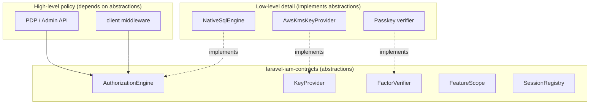

# Why a contracts-only package

This is the question the whole repository answers: *why ship a package that contains no behaviour at all —
only interfaces and value objects?* The short answer is **decoupling**. The long answer is below.

## Motivation — the coupling hazard

A control plane split across many packages has a structural risk: if the client imports a server class, or
the directory module imports a concrete cipher, the packages become a tangle. Three concrete failures
follow:

- **You cannot release independently.** A change in the server forces a coordinated release of every
  package that reached into its internals.
- **You cannot swap an implementation.** Code typed against `NativeSqlEngine` cannot accept an
  `OpenFgaEngine` without edits.
- **A change ripples everywhere.** One refactor in a concrete class breaks every consumer that depended on
  its shape.

The contracts package removes the hazard by giving every package **exactly one thing they are allowed to
depend on**, and making that thing pure abstraction.

## Theory — the dependency inversion principle

The package is a direct application of the **Dependency Inversion Principle**:

> High-level modules should not depend on low-level modules. Both should depend on **abstractions**.
> Abstractions should not depend on details. Details should depend on abstractions.

Concretely, both the *policy* (the PDP, the Admin API, the client middleware) and the *mechanism* (the
SQL engine, the AWS KMS key provider, the passkey verifier) depend on the same set of interfaces — and on
nothing of each other. The interfaces live here, at the root.

Formally, let the set of packages be a directed graph $G = (V, E)$ where an edge $u \to v$ means *"$u$
depends on $v$"*. The contracts package $c$ is the unique **sink** every other node can reach, and $c$
itself has out-degree zero:

$$
\forall v \in V \setminus \{c\}: \; (v \to c) \in E^{*} \qquad\text{and}\qquad \deg^{+}(c) = 0
$$

Because $c$ has no outgoing edges, it can never participate in a dependency cycle, and it can be released
without rebuilding anything it points at — there is nothing it points at.

## Design — where the contracts sit



The arrows from policy point **down** to the abstraction; the arrows from the mechanism also point **up**
to the abstraction. Neither side points at the other. That inverted shape is what the package buys.

## What you get

| Property | How the contracts package delivers it |
| --- | --- |
| **Pluggability** | Any class satisfying an interface can be wired in via the container — no consumer edit. |
| **Independent releases** | Packages agree on the *contract version*, not on each other's internals. |
| **ABI stability** | The surface is tiny and reviewed; a signature change is a deliberate, semver-gated event. |
| **No dependency bloat** | `require` is `php` only — installing the contracts never pulls in a framework. |
| **Fail-closed by construction** | Signatures bake in safe defaults (see [Fail-closed by design](/concepts/fail-closed)). |

## ADR

::: collapsible "ADR-001 — Ship contracts as a standalone, dependency-free package"
**Problem.** The Laravel IAM platform is many packages (server, client, AI, directory, bridge, three
SDKs). They must interoperate, be releasable independently, and allow implementations (PDP engine, key
custodian, factor verifier) to be swapped. If each package depended on concrete classes in the others, the
graph would contain cycles, releases would be lockstep, and nothing would be swappable.

**Decision.** Extract every shared **interface** and **value object** into a single package,
`laravel-iam-contracts`, that:

- contains **no implementations** and **no behaviour** beyond tiny pure helpers on enums;
- requires **`php` only** — no `illuminate/*`, no runtime dependencies;
- is the **single allowed dependency** every other ecosystem package shares;
- is **the sink** of the dependency graph (out-degree zero).

**Consequences.**
- *Positive:* no dependency cycles; independent releases; implementations are swappable behind the
  container; the contract surface is small enough to review every change; consumers never inherit a
  framework from the contracts.
- *Negative / cost:* changing a published interface is a breaking change for **every** implementor, so the
  package must be versioned conservatively and evolve by **adding new interfaces** rather than mutating
  existing ones (see [Versioning & ABI stability](/architecture/versioning)).
- *Neutral:* some early signatures use `array<string, mixed>` placeholders (e.g.
  `AuthorizationEngine::check()`) that will harden into dedicated DTOs in a future major — a documented,
  intentional trade-off between shipping now and a perfect type surface.
:::

## Worked example — swapping the engine without touching consumers

Today the native engine resolves RBAC + ABAC + ReBAC over SQL:

```php
$engine = new NativeSqlEngine(/* ... */);   // lives in laravel-iam-server
```

Tomorrow, at Zanzibar scale, you bind a different adapter:

```php
$engine = new OpenFgaEngine($fgaClient);     // hypothetical v2 adapter
```

Both satisfy `AuthorizationEngine`. The PDP, the Admin API and the client middleware — **none of them
change**, because they were typed against the contract, never the class.

## Gotchas

::: callout warning "Things that quietly defeat the purpose" icon:alert-triangle
- **Adding a runtime dependency here.** The moment this package requires `illuminate/*` or any concrete
  library, every consumer inherits it. Keep `require` at `php` only.
- **Putting behaviour in the contracts.** Beyond pure helpers on enums (e.g. `Aal::satisfies()`), logic
  belongs in implementations. A contract with logic becomes a thing to couple to.
- **Mutating a published interface.** Adding or changing a method breaks every implementor. Prefer a new
  interface and bump the major version.
:::

## Related

- [Ports & adapters](/concepts/ports-and-adapters) — the architectural pattern this realises.
- [Fail-closed by design](/concepts/fail-closed) — how the signatures encode safety.
- [Versioning & ABI stability](/architecture/versioning) — what counts as breaking.
