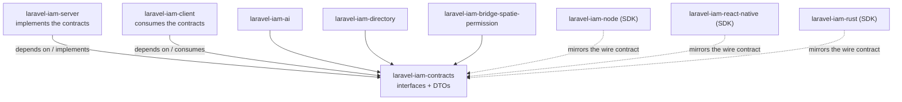

# laravel-iam-contracts


> **The shared contract layer of the [Laravel IAM](https://github.com/padosoft) ecosystem.**
> Interfaces and immutable value objects that every `padosoft/laravel-iam-*` package implements or consumes — and **nothing else**. No implementations, no Laravel dependency, no runtime dependencies at all (just PHP 8.3+).

::: callout tip "Depend on abstractions, not implementations" icon:compass
This package contains **zero behaviour** — only the seams the rest of the ecosystem agrees on. Swap the
PDP engine, the key custodian or the passkey verifier without touching a line of consuming code. That is
the whole point of shipping the contracts as a separate package.
:::

---

## What it is — in one minute

Laravel IAM is an **Identity & Authorization Control Plane** split across many packages: a server, a
client, governance/AI modules, a directory connector, migration bridges, and SDKs in three languages. They
all need to speak the same language:

- *What is a subject?* → [`SubjectRef`](/reference/authorization)
- *How does the PDP decide allow/deny?* → [`AuthorizationEngine`](/reference/authorization)
- *How is a secret encrypted, a token signed?* → [`KeyProvider`, `SecretCipher`, `TokenSigner`](/reference/crypto)
- *What is an assurance level, a step-up?* → [`Aal`, `StepUpProvider`](/reference/assurance)
- *How is a session tracked and revoked?* → [`SessionRegistry`](/reference/identity)
- *How is a governance feature gated?* → [`FeatureScope`](/reference/governance)

`laravel-iam-contracts` **is** that language. It is the **dependency root** of the ecosystem: everything
depends on it, it depends on nothing.

> **In one line:** *one tiny, dependency-free package of interfaces and DTOs that makes the entire
> platform pluggable — because consumers type against abstractions, never implementations.*

---

## Why a separate package of only contracts

::: grids
  ::: grid
    ::: card "Pluggability" icon:plug
    Implement `AuthorizationEngine` against OpenFGA/SpiceDB, `KeyProvider` against AWS KMS or an HSM, or
    `FactorVerifier` against an external SCA provider — and **no consuming code changes**.
    :::
  :::
  ::: grid
    ::: card "Independent releases" icon:git-branch
    Server, client and SDKs version on their own cadence; they only have to agree on the **contract**
    version. The dependency graph is a DAG with this package at the root.
    :::
  :::
  ::: grid
    ::: card "ABI stability" icon:shield-check
    A method signature here is a promise to every implementor across the ecosystem. Changing one is a
    breaking change — so the package is deliberately small, reviewed, and semver-disciplined.
    :::
  :::
  ::: grid
    ::: card "Zero dependencies" icon:feather
    `require` is `php: ^8.3` only. It installs anywhere and drags nothing in — no `illuminate/*`, no
    transitive surprises for the apps that consume it.
    :::
  :::
:::

[Read the full rationale →](/concepts/why-contracts)

---

## The ecosystem at a glance

This package sits at the bottom of the dependency graph. The server **implements** the contracts; clients
and SDKs **consume** them.



| Package | Role |
| --- | --- |
| **laravel-iam-contracts** *(this repo)* | Shared interfaces & DTOs — the dependency root |
| [laravel-iam-server](https://doc.laravel-iam-server.padosoft.com) | The IAM server: identity, org, Application Registry, PDP (RBAC+ABAC+ReBAC), OAuth/OIDC, audit, governance, Admin API & panel |
| [laravel-iam-client](https://doc.laravel-iam-client.padosoft.com) | Client for apps consuming Laravel IAM: OIDC login, JWT/JWKS, introspection, `iam.auth`/`iam.can` middleware, Gate adapter |
| [laravel-iam-ai](https://doc.laravel-iam-ai.padosoft.com) | Optional AI module: advisory-only governance (redaction + hallucination guard + audit) |
| [laravel-iam-directory](https://doc.laravel-iam-directory.padosoft.com) | Optional directory module: LDAP / Active Directory (LdapRecord) |
| [laravel-iam-bridge-spatie-permission](https://doc.laravel-iam-bridge-spatie-permission.padosoft.com) | Migration bridge from spatie/laravel-permission: scan, shadow mode, cutover, rollback |
| [laravel-iam-node](https://doc.laravel-iam-node.padosoft.com) | SDK client Node/TS (`@padosoft/laravel-iam-node`), thin + fail-closed |
| [laravel-iam-react-native](https://doc.laravel-iam-react-native.padosoft.com) | SDK client React Native (`@padosoft/laravel-iam-react-native`), thin + hooks |
| [laravel-iam-rust](https://doc.laravel-iam-rust.padosoft.com) | SDK client Rust (crate `laravel-iam`), async + blocking, fail-closed |

---

## Install

```bash
composer require padosoft/laravel-iam-contracts
```

**Requirements:** PHP **8.3+**. No Laravel required — this package is framework-agnostic and
dependency-free. Autoloading is PSR-4 under `Padosoft\Iam\Contracts\`.

---

## Start here

::: grids
  ::: grid
    ::: card "Quickstart" icon:zap
    Implement your first contract — a fail-closed authorization engine — in five minutes. **[Open →](/quickstart)**
    :::
  :::
  ::: grid
    ::: card "Why contracts?" icon:lightbulb
    Decoupling, independent releases, ABI stability — the design argument for a contracts-only package. **[Read →](/concepts/why-contracts)**
    :::
  :::
  ::: grid
    ::: card "Contract reference" icon:book-marked
    Every interface and DTO, grouped by namespace, with exact signatures and who implements / consumes each. **[Browse →](/reference/overview)**
    :::
  :::
:::

::: callout info "Package facts" icon:info
Composer `padosoft/laravel-iam-contracts` · PHP `^8.3` · **zero runtime dependencies** · MIT ·
[GitHub](https://github.com/padosoft/laravel-iam-contracts) ·
[Packagist](https://packagist.org/packages/padosoft/laravel-iam-contracts)
:::
