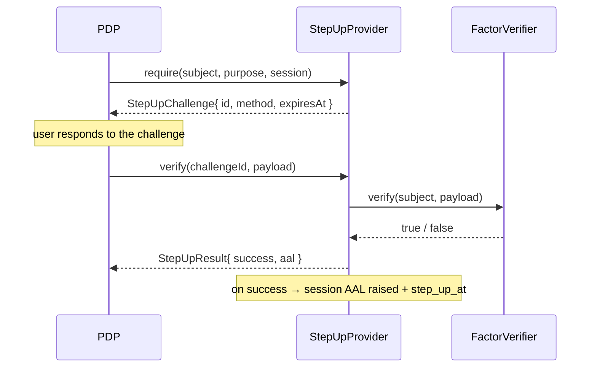

# Assurance

The assurance namespace encodes **how strongly a subject is authenticated** (NIST 800-63B) and the
**step-up** flow that raises that strength before a critical action. See
`laravel-iam-docs/10-*.md §4` and `doc 14`.

## `Aal` (enum)

`Padosoft\Iam\Contracts\Assurance\Aal` · `enum Aal: string`

Authenticator Assurance Level:

| Case | Value | Meaning |
| --- | --- | --- |
| `Aal::AAL1` | `aal1` | single factor (password) |
| `Aal::AAL2` | `aal2` | MFA / passkey (WebAuthn user-verifying) |
| `Aal::AAL3` | `aal3` | hardware / cryptographic authenticator (FIDO2 resident key, PSD2) |

### Contract

```php
enum Aal: string
{
    case AAL1 = 'aal1';
    case AAL2 = 'aal2';
    case AAL3 = 'aal3';

    public function rank(): int;                 // AAL1→1, AAL2→2, AAL3→3
    public function satisfies(self $required): bool;   // $this->rank() >= $required->rank()
    public static function fromString(?string $value): self;   // unknown / null ⇒ AAL1
}
```

### Why the helpers matter

`rank()` gives the strength ordering; `satisfies()` answers "does the current level meet the requirement?"
in one call (`AAL2` satisfies an `AAL1` requirement, not vice-versa). `fromString()` is **fail-safe**: an
unknown or `null` value maps to the **weakest** level, `AAL1`, so a missing assurance claim *fails* a
step-up check rather than passing it. See [Fail-closed by design](/concepts/fail-closed).

### Example

```php
use Padosoft\Iam\Contracts\Assurance\Aal;

Aal::AAL2->satisfies(Aal::AAL1);   // true
Aal::AAL1->satisfies(Aal::AAL2);   // false → step-up required
Aal::fromString(null);             // Aal::AAL1 (fail-safe)
Aal::fromString('aal3')->rank();   // 3
```

---

## `AssuranceProvider`

`Padosoft\Iam\Contracts\Assurance\AssuranceProvider` · `interface`

Provides the **current** assurance level of a session. The native provider derives the AAL from the
session; an adapter (e.g. Rebel) can compute richer trust scoring.

### Contract

```php
interface AssuranceProvider
{
    /** Current AAL of the subject on the session (AAL1 if the session is not active). */
    public function currentAal(SubjectRef $subject, SessionRef $session): Aal;

    /** True if this provider can raise the subject to the requested AAL. */
    public function supports(Aal $target): bool;
}
```

::: callout warning "Fail-closed default" icon:shield-alert
`currentAal()` is documented to return **`AAL1`** when the session is not active — the safe floor, never an
optimistic high level.
:::

---

## `StepUpProvider`

`Padosoft\Iam\Contracts\Assurance\StepUpProvider` · `interface`

Step-up of assurance on a critical action. The PDP requests `requires_step_up`; the provider issues a
challenge and, on successful `verify`, raises the session AAL and records `step_up_at`. See `doc 10 §4`,
`doc 14`.

### Contract

```php
interface StepUpProvider
{
    public function require(SubjectRef $subject, StepUpPurpose $purpose, SessionRef $session): StepUpChallenge;

    /**
     * Verify the response to the challenge; if valid, raise the session to the required AAL.
     *
     * @param  array<string, mixed>  $payload
     */
    public function verify(string $challengeId, array $payload): StepUpResult;
}
```

### The step-up lifecycle



---

## `FactorVerifier`

`Padosoft\Iam\Contracts\Assurance\FactorVerifier` · `interface`

Verify a single authentication factor (TOTP, passkey/WebAuthn) for the subject. It is the plug point toward
Fortify / laravel-passkeys (wired in M5.4) or an adapter (Rebel/SCA). In M5.2 the `StepUpProvider` uses it
as a pluggable dependency — see [ADR-007](/architecture/decisions).

### Contract

```php
interface FactorVerifier
{
    /** @param  array<string, mixed>  $payload */
    public function verify(SubjectRef $subject, array $payload): bool;
}
```

---

## Assurance DTOs

All `final readonly`.

### `StepUpPurpose`

The reason for a step-up: the critical `action` and the `requiredAal` the PDP demands (defaults to `AAL2`).

```php
final readonly class StepUpPurpose
{
    public function __construct(
        public string $action,
        public Aal $requiredAal = Aal::AAL2,
    ) {}
}
```

### `StepUpChallenge`

The challenge issued to the subject: the `id` to answer, the required `method` (`totp` | `passkey`), and the
`expiresAt` deadline.

```php
final readonly class StepUpChallenge
{
    public function __construct(
        public string $id,
        public string $method,
        public \DateTimeImmutable $expiresAt,
    ) {}
}
```

### `StepUpResult`

The outcome of a verify: whether it `success`-ed and, if so, the `aal` the session was raised to.

```php
final readonly class StepUpResult
{
    public function __construct(
        public bool $success,
        public Aal $aal,
    ) {}
}
```

## Who implements / consumes the assurance contracts

| | |
| --- | --- |
| **Implemented by** | native AAL-from-session provider, native step-up; `FactorVerifier` bound to Fortify/laravel-passkeys or an external SCA adapter (all in/around `laravel-iam-server`) |
| **Consumed by** | the PDP (raises `requires_step_up`), the OIDC/session flow, `laravel-iam-client` (reads the AAL claim) |

## Worked example — gating an action behind AAL2

```php
use Padosoft\Iam\Contracts\Assurance\Aal;
use Padosoft\Iam\Contracts\Assurance\AssuranceProvider;
use Padosoft\Iam\Contracts\Assurance\StepUpProvider;
use Padosoft\Iam\Contracts\Assurance\StepUpPurpose;

function ensureAal2(
    AssuranceProvider $assurance,
    StepUpProvider $stepUp,
    SubjectRef $subject,
    SessionRef $session,
): void {
    if ($assurance->currentAal($subject, $session)->satisfies(Aal::AAL2)) {
        return; // already strong enough
    }

    $challenge = $stepUp->require(
        $subject,
        new StepUpPurpose(action: 'wire.transfer', requiredAal: Aal::AAL2),
        $session,
    );
    // present $challenge to the user, then call $stepUp->verify($challenge->id, $payload)
}
```

## Gotchas

::: callout warning "Assurance traps" icon:alert-triangle
- **Never coalesce `fromString()` to a strong default.** The built-in `?? AAL1` is the safe one; overriding
  it re-introduces fail-open.
- **Respect challenge expiry.** `verify()` must reject a `StepUpChallenge` past its `expiresAt`.
- **`verify()` returns a `StepUpResult`, not a bare bool** — read `->success` and apply `->aal`.
:::

## Related

- [Fail-closed by design](/concepts/fail-closed) — `fromString(null) ⇒ AAL1`.
- [Identity](/reference/identity) — the session whose AAL gets raised.
- [Authorization](/reference/authorization) — where `requires_step_up` originates.
