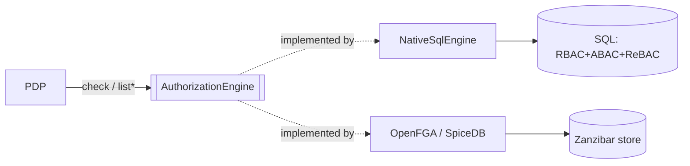

# Authorization

The authorization namespace holds the heart of the platform: the **pluggable PDP** contract and the
**subject reference** value object every decision is phrased in terms of.

## `SubjectRef`

`Padosoft\Iam\Contracts\Support\SubjectRef` · `final readonly class … implements \Stringable`

A reference to a PDP subject. The type is one of `user | group | service_account | external_group | agent`
(see `laravel-iam-docs/09-authorization-and-pdp.md §3`).

### Contract

```php
final readonly class SubjectRef implements \Stringable
{
    public function __construct(
        public string $type,
        public string $id,
    ) {}

    public function __toString(): string;   // "{type}:{id}"
}
```

### Why it exists

A control plane references subjects constantly — in policy tuples, audit records, cache keys, logs. A bare
`"user:42"` string is easy to mistype and impossible to type-check. `SubjectRef` is the single, typed,
`Stringable` reference used everywhere (see [ADR-004](/architecture/decisions)).

### Who implements / consumes it

It is a value object, so nobody *implements* it — everybody **constructs** and **passes** it: the PDP, the
client middleware, the directory module (mapping LDAP/AD principals), the bridge (diffing decisions), and
the reverse-index methods of `AuthorizationEngine`.

### Example

```php
use Padosoft\Iam\Contracts\Support\SubjectRef;

$user  = new SubjectRef('user', '42');
$agent = new SubjectRef('agent', 'rag-bot');

(string) $user;    // "user:42"
(string) $agent;   // "agent:rag-bot"
```

---

## `AuthorizationEngine`

`Padosoft\Iam\Contracts\Authorization\AuthorizationEngine` · `interface`

The pluggable engine behind the Policy Decision Point. The native engine (`NativeSqlEngine`) covers RBAC +
ABAC + ReBAC over SQL; for Zanzibar scale an OpenFGA/SpiceDB adapter slots in **without changing the PDP**.
See `laravel-iam-docs/09-authorization-and-pdp.md` §4 (combining), §9 (schema), §10 (engine).

### Contract

```php
interface AuthorizationEngine
{
    /**
     * Deterministic allow/deny decision (+ explain, step-up, policy_version).
     *
     * @param  array<string, mixed>  $query   TODO(M2): DecisionQuery
     * @return array<string, mixed>           TODO(M2): Decision
     */
    public function check(array $query): array;

    /**
     * Who has `relation` on `object` (reverse-index) → list-subjects.
     *
     * @return iterable<SubjectRef>
     */
    public function listSubjects(string $relation, string $objectType, string $objectId): iterable;

    /**
     * On what `subject` has `relation` → list-resources.
     *
     * @return iterable<array{type: string, id: string}>
     */
    public function listResources(SubjectRef $subject, string $relation): iterable;
}
```

### Why the signatures look like this

`check()` uses `array<string, mixed>` for both query and result **today**, with a documented `TODO(M2)` to
harden into `DecisionQuery` / `Decision` value objects. The array shape mirrors the HTTP wire contract so
the in-process and over-the-wire forms stay isomorphic — see [ADR-002](/architecture/decisions). The two
`list*` methods are the **reverse index** (Zanzibar-style): "who can do X on this?" and "what can this
subject do X on?".

### The decision shape

`check()`'s array result is documented (not yet typed). The keys the platform reads:

| Key | Meaning |
| --- | --- |
| `decision` | `"allow"` or `"deny"` — the verdict |
| `reason` | a stable machine code (e.g. `no_matching_grant`, `explicit_deny`) |
| `explain` | optional trace of the rules that fired (§4/§8) |
| `requires_step_up` | optional flag asking for higher assurance before allow |
| `policy_version` | optional version of the policy that produced the decision |

This is the in-process equivalent of the wire response `data` object from
`POST {base}/api/iam/v1/decisions/check`.

### Invariants an implementation must keep

::: callout warning "Non-negotiable" icon:shield-alert
- **Deterministic.** The same query yields the same decision.
- **Deny-overrides.** If any applicable rule denies, the decision is deny — regardless of allows.
- **Never fail-open.** No grant, or any internal error, resolves to **deny**, never allow. See
  [Fail-closed by design](/concepts/fail-closed).
:::

### Who implements / consumes it

| | |
| --- | --- |
| **Implemented by** | `NativeSqlEngine` (in `laravel-iam-server`); OpenFGA/SpiceDB adapter (planned) |
| **Consumed by** | the PDP, the Admin API, `laravel-iam-client` middleware, the spatie-permission bridge (shadow-mode diffing) |

### Design



### Worked example

A full fail-closed skeleton (store wiring, deny-overrides, reverse index) is in
[Implementing a contract](/guides/implementing-a-contract#worked-example--an-authorizationengine).

### Gotchas

::: callout warning "Implementer traps" icon:alert-triangle
- **Don't fail-open on error.** Catch a store error → return deny, not allow.
- **Emit the documented keys.** Consumers read `decision`/`reason`; omitting them breaks the contract.
- **`list*` are generators-friendly.** Returning `iterable` lets you `yield` lazily over large result sets
  — don't materialise millions of rows.
:::

## Related

- [Crypto](/reference/crypto) — keys & tokens the decisions ride on.
- [Assurance](/reference/assurance) — `requires_step_up` resolves here.
- [Consuming contracts](/guides/consuming-contracts) — reading decisions fail-closed.
