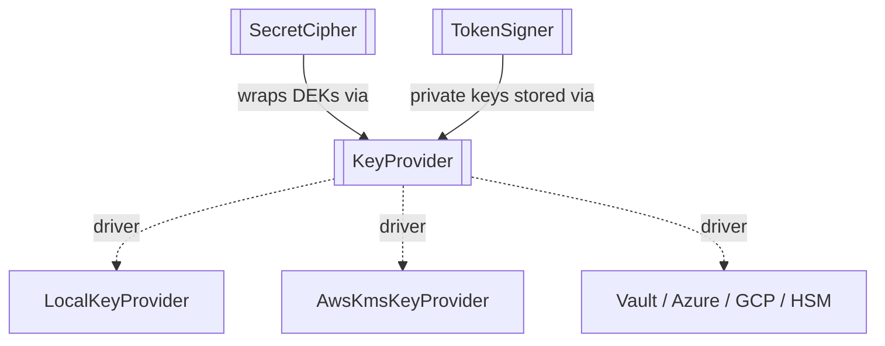
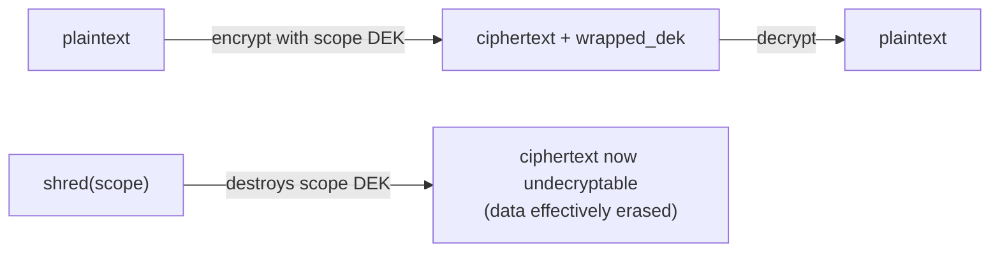
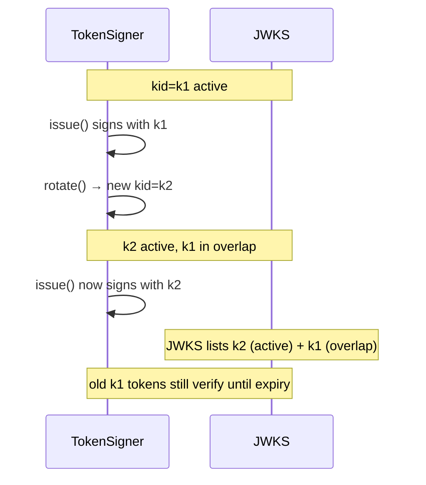

# Crypto

Three interfaces form the cryptographic seam. They are deliberately split so the **key custodian**, the
**secret store**, and the **token signer** can each be swapped independently. See
`laravel-iam-docs/11-crypto-and-key-management.md`.

## How they relate



`KeyProvider` is the root custodian. `SecretCipher` uses it for **envelope encryption** of application
secrets; `TokenSigner` uses it to keep signing private keys encrypted at rest.

---

## `KeyProvider`

`Padosoft\Iam\Contracts\Crypto\KeyProvider` · `interface`

DEK (Data Encryption Key) management for **envelope encryption**: wrap/unwrap a DEK with the active KEK
(Key Encryption Key). Token *signing* is separate — see `TokenSigner`. Drivers: `LocalKeyProvider` (v1),
`AwsKmsKeyProvider` (M3.x), Vault/Azure/GCP/HSM (v2). See §3–§5.

### Contract

```php
interface KeyProvider
{
    /**
     * Wrap (encrypt) a DEK with the active KEK.
     *
     * @return array{ciphertext: string, key_id: string, key_version: int}
     */
    public function wrapDataKey(string $plaintextDek): array;

    /**
     * Unwrap (decrypt) a previously wrapped DEK.
     *
     * @param  array{ciphertext: string, key_id: string, key_version: int}  $wrapped
     */
    public function unwrapDataKey(array $wrapped): string;

    /**
     * Generate a new DEK (plaintext + already wrapped).
     *
     * @return array{plaintext: string, wrapped: array{ciphertext: string, key_id: string, key_version: int}}
     */
    public function generateDataKey(): array;
}
```

### Why envelope encryption

You never encrypt large data directly with the KEK. Instead you generate a per-item **DEK**, encrypt the
data with it, then **wrap** the DEK with the KEK. Rotating the KEK then only re-wraps small DEKs, not all
your data — and the KEK can live in a KMS/HSM that never exposes raw key material. The `key_id` /
`key_version` travel with the ciphertext so unwrap knows which KEK generation to use.

### Who implements / consumes it

| | |
| --- | --- |
| **Implemented by** | `LocalKeyProvider` (v1); `AwsKmsKeyProvider` (M3.x); Vault/Azure/GCP/HSM (v2) |
| **Consumed by** | `SecretCipher`, `TokenSigner`, and any code persisting encrypted blobs |

---

## `SecretCipher`

`Padosoft\Iam\Contracts\Crypto\SecretCipher` · `interface`

Encrypt/decrypt application secrets (client secrets, upstream secrets, PII) via envelope encryption. The
`scope` parameter enables **per-tenant / per-subject DEKs** and therefore **crypto-shredding** — the GDPR
right-to-erasure implemented by destroying a scope's key rather than chasing every copy of the data. See §4,
§8.

### Contract

```php
interface SecretCipher
{
    /**
     * Encrypt a value. `scope` enables per-tenant DEKs (crypto-shredding).
     *
     * @return array{ciphertext: string, wrapped_dek: string|null, key_id: string, key_version: int, scope: string|null}
     */
    public function encrypt(string $plaintext, ?string $scope = null): array;

    /**
     * Decrypt a previously encrypted value.
     *
     * @param  array{ciphertext: string, wrapped_dek: string|null, key_id: string, key_version: int, scope: string|null}  $value
     */
    public function decrypt(array $value): string;

    /** Destroy the DEK(s) of a scope → irreversible crypto-shredding. */
    public function shred(string $scope): void;
}
```

### Crypto-shredding in one diagram



After `shred(scope)`, every value encrypted under that scope becomes permanently undecryptable — you have
"deleted" the data without locating each copy. That is the right-to-erasure guarantee.

### Invariants

::: callout warning "Honour these" icon:shield-alert
- **`shred()` is irreversible.** Once a scope's DEK is destroyed, its ciphertexts can never be recovered.
  Treat it as a destructive, audited operation.
- **`scope` must be stable.** Use the same scope (e.g. a tenant id) for everything that should erase
  together.
:::

### Who implements / consumes it

| | |
| --- | --- |
| **Implemented by** | an envelope cipher over a `KeyProvider` (in `laravel-iam-server`) |
| **Consumed by** | client-secret storage, upstream-secret storage, PII fields needing erasure |

---

## `TokenSigner`

`Padosoft\Iam\Contracts\Crypto\TokenSigner` · `interface`

Issue and verify signed JWTs (asymmetric, **ES256**) plus JWKS exposure and key rotation. Private keys are
stored encrypted (via `KeyProvider`); the public key is exposed in the JWKS. See
`laravel-iam-docs/13-oauth-oidc-server.md` (tokens) and `11` (JWKS rotation).

### Contract

```php
interface TokenSigner
{
    /**
     * Issue a signed JWT with the given claims (adds iat/exp/jti and the kid header).
     *
     * @param  array<string, mixed>  $claims
     */
    public function issue(array $claims, int $ttlSeconds): string;

    /**
     * Verify signature + expiry and return the claims. Throws on an invalid token.
     *
     * @return array<string, mixed>
     */
    public function parse(string $jwt): array;

    /**
     * JWKS: active + overlapping public keys (for rotation).
     *
     * @return list<array<string, mixed>>
     */
    public function jwks(): array;

    /** Rotate the signing key (new active; previous kept in overlap). Returns the new kid. */
    public function rotate(): string;

    /**
     * Public PEM of the active key (external verification / engine placeholders).
     *
     * @return non-empty-string
     */
    public function verificationPem(): string;
}
```

### Why asymmetric + JWKS + rotation

Asymmetric ES256 lets **anyone** verify a token with the public key while only the server can sign. The
**JWKS** publishes the active public keys; during `rotate()` the previous key is kept **in overlap** so
tokens signed just before rotation still verify until they expire. `verificationPem()` exposes the active
public PEM for external verifiers (or as a valid-key placeholder for engines that require one but to which
the platform does **not** delegate signing).

### Rotation timeline



### Invariants

::: callout warning "Honour these" icon:shield-alert
- **`parse()` throws on invalid.** A bad signature or expired token is an exception, not a silently
  "empty" claim set — callers must treat a throw as deny.
- **Keep the previous key in overlap.** Dropping it immediately on `rotate()` invalidates in-flight tokens.
- **`verificationPem()` returns non-empty.** It guarantees an active key exists; it is **public** material
  (already in the JWKS).
:::

### Who implements / consumes it

| | |
| --- | --- |
| **Implemented by** | an ES256 signer with JWKS rotation (in `laravel-iam-server`) |
| **Consumed by** | the OAuth/OIDC token endpoints; `laravel-iam-client` verifies via JWKS |

## Related

- [Authorization](/reference/authorization) — decisions the tokens authorize.
- [Identity](/reference/identity) — sessions bound to tokens via `sid`.
- [Implementing a contract](/guides/implementing-a-contract) — building a custom key custodian.
