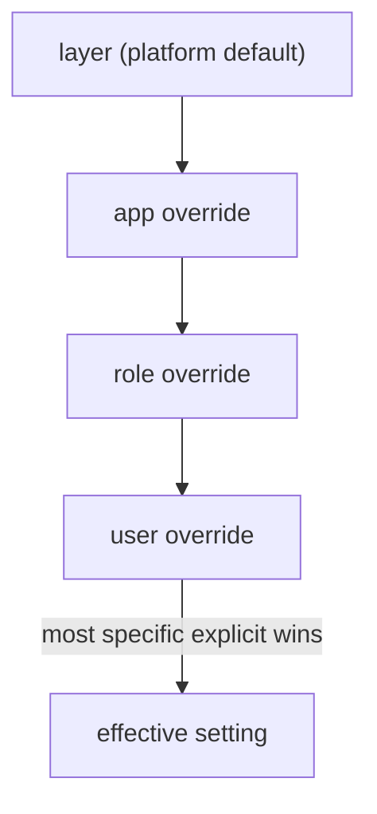

# Governance

Identity Governance & Administration (IGA) has many features — Access Review, Access Request, PIM,
Separation of Duties, least-privilege, anomaly detection — and every one of them must be toggleable and
scopable per organization, app, role or user. Rather than a bespoke gate per feature, the platform exposes
**one** primitive. See `laravel-iam-docs/14-governance-and-iga.md §1 (ADR-FS-001)` and
[ADR-006](/architecture/decisions).

## `FeatureScope`

`Padosoft\Iam\Contracts\Governance\FeatureScope` · `interface`

The cross-cutting primitive that makes any governance feature **on/off** and **granular** across four
cascading levels (layer → app → role → user), with a safe default and a permission gate.

### Contract

```php
interface FeatureScope
{
    /** Is the feature enabled for this context? (cascade layer→app→role→user) */
    public function isEnabled(FeatureContext $ctx): bool;

    /** Does the subject hold the permission that gates use of the feature? */
    public function isPermitted(FeatureContext $ctx, SubjectRef $actor): bool;

    /** Feature mode where applicable (e.g. SoD: 'off'|'detect'|'enforce'). */
    public function mode(FeatureContext $ctx): string;
}
```

### The two questions + the mode

A consumer asks two yes/no questions and, where relevant, reads a mode:

- **`isEnabled($ctx)`** — is the feature switched on for this org/app/role/user?
- **`isPermitted($ctx, $actor)`** — may *this actor* use it (the permission gate)?
- **`mode($ctx)`** — for features with graduated behaviour (SoD `'off' | 'detect' | 'enforce'`), which mode
  applies.

Both gates must pass before a feature runs:

```php
if ($scope->isEnabled($ctx) && $scope->isPermitted($ctx, $actor)) {
    // feature is on AND the actor may use it
}
```

---

## `FeatureKey` (enum)

`Padosoft\Iam\Contracts\Governance\FeatureKey` · `enum FeatureKey: string`

Which governance feature is being gated:

| Case | Value |
| --- | --- |
| `AccessReview` | `access_review` |
| `AccessRequest` | `access_request` |
| `Pim` | `pim` |
| `SoD` | `sod` |
| `LeastPrivilege` | `least_privilege` |
| `AnomalyDetection` | `anomaly_detection` |

Adding a governance feature is a **new enum case**, not a new interface — the cascade resolver is reused
unchanged.

---

## `ScopeLevel` (enum)

`Padosoft\Iam\Contracts\Governance\ScopeLevel` · `enum ScopeLevel: string`

The cascade levels a feature can be scoped on:

| Case | Value |
| --- | --- |
| `Layer` | `layer` |
| `App` | `app` |
| `Role` | `role` |
| `User` | `user` |

**Resolution rule:** the most specific *explicit* setting wins — `user > role > app > layer`.



If a user-level setting exists it decides; otherwise fall back to role, then app, then the layer default.

---

## `FeatureContext` (DTO)

`Padosoft\Iam\Contracts\Governance\FeatureContext` · `final readonly class`

The evaluation context for a feature scope — which feature, and the coordinates of the cascade.

```php
final readonly class FeatureContext
{
    public function __construct(
        public FeatureKey $feature,
        public ?string $organizationId = null,
        public ?string $applicationKey = null,
        public ?string $roleKey = null,
        public ?SubjectRef $subject = null,
    ) {}
}
```

The non-null fields tell the resolver how specific the query is: supplying `roleKey` lets it consider a
role-level override; supplying `subject` lets it consider a user-level one.

---

## Who implements / consumes the governance contracts

| | |
| --- | --- |
| **Implemented by** | the native cascade resolver (in `laravel-iam-server`) |
| **Consumed by** | the governance/IGA features themselves, the Admin API/panel (toggling scopes), and `laravel-iam-ai` (advisory features gated by scope) |

## Worked example — rolling out PIM per role

```php
use Padosoft\Iam\Contracts\Governance\FeatureScope;
use Padosoft\Iam\Contracts\Governance\FeatureContext;
use Padosoft\Iam\Contracts\Governance\FeatureKey;
use Padosoft\Iam\Contracts\Support\SubjectRef;

function pimEnforced(FeatureScope $scope, string $org, string $role, SubjectRef $actor): bool
{
    $ctx = new FeatureContext(
        feature: FeatureKey::Pim,
        organizationId: $org,
        roleKey: $role,
        subject: $actor,
    );

    return $scope->isEnabled($ctx)
        && $scope->isPermitted($ctx, $actor)
        && $scope->mode($ctx) === 'enforce';
}
```

## Gotchas

::: callout warning "Governance traps" icon:alert-triangle
- **Provide enough context.** Omitting `roleKey`/`subject` means the resolver can't see role/user overrides
  — you'll get the broader (app/layer) answer.
- **`mode()` is a string by design.** It stays open to feature-specific modes; compare to the documented
  literals (`'off'|'detect'|'enforce'` for SoD), don't assume a closed enum.
- **A new `FeatureKey` case** can break an exhaustive `match` in a consumer — see
  [Versioning](/architecture/versioning).
:::

## Related

- [Architecture decisions](/architecture/decisions) — ADR-006, the one-primitive choice.
- [Authorization](/reference/authorization) — `isPermitted` rides the PDP.
- [Consuming contracts](/guides/consuming-contracts) — gating features in app code.
