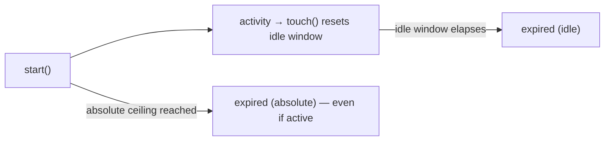
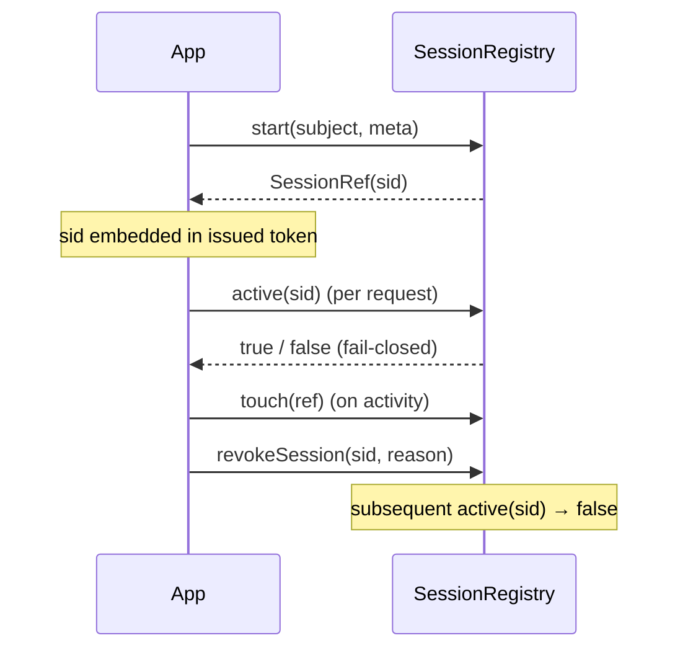

# Identity

The identity namespace models **server-side sessions** that are revocable *before* a token expires. A token
alone can't be un-issued; binding it to a session via a `sid` means the platform can revoke access on
demand. See `laravel-iam-docs/10-*.md §3/§4`.

## `SessionRef`

`Padosoft\Iam\Contracts\Identity\SessionRef` · `final readonly class … implements \Stringable`

A reference to a server-side session. Its `id` is the **`sid`** that binds tokens to the session — so
revocation is possible before token expiry.

### Contract

```php
final readonly class SessionRef implements \Stringable
{
    public function __construct(public string $id) {}

    public function __toString(): string;   // the sid
}
```

---

## `SessionMeta`

`Padosoft\Iam\Contracts\Identity\SessionMeta` · `final readonly class`

The metadata a session opens with. Device/IP/UA identifiers are **already hashed by the caller** (privacy by
design — see [ADR-005](/architecture/decisions)). Timeouts are in **seconds**; the absolute timeout is the
non-extendable ceiling.

### Contract

```php
final readonly class SessionMeta
{
    public function __construct(
        public Aal $aal = Aal::AAL1,
        public ?string $organizationId = null,
        public ?string $deviceFingerprintHash = null,
        public ?string $ipHash = null,
        public ?string $userAgentHash = null,
        public int $idleTimeout = 1800,        // 30 min
        public int $absoluteTimeout = 43200,   // 12 h — never extended
    ) {}
}
```

### Idle vs. absolute timeout



`touch()` keeps pushing the **idle** window forward on each activity; the **absolute** timeout is a hard
ceiling that is **never** extended, so a session always ends within `absoluteTimeout` of `start()` no matter
how active it is.

::: callout tip "Why hashes, not raw values" icon:shield-check
Storing raw IPs and device fingerprints is a privacy liability. The contract takes only `*Hash` fields, so
the registry never sees raw identifiers — the caller owns the hashing policy (salt, algorithm). This makes
the privacy-preserving path the default one.
:::

---

## `SessionRegistry`

`Padosoft\Iam\Contracts\Identity\SessionRegistry` · `interface`

The server-side registry of sessions. Every session is revocable and bound to tokens via `sid`. Idle
timeout + absolute timeout; the absolute timeout is never extended.

### Contract

```php
interface SessionRegistry
{
    /** Open a session and return its reference (sid). */
    public function start(SubjectRef $subject, SessionMeta $meta): SessionRef;

    /** Update last_activity_at (idle timeout). No-op if the session is no longer active. */
    public function touch(SessionRef $session): void;

    /** True iff the session exists, is not revoked and is not expired (idle/absolute). Fail-closed. */
    public function active(string $sessionId): bool;

    public function revokeSession(string $sessionId, string $reason): void;

    public function revokeAllForSubject(SubjectRef $subject, string $reason): void;

    /**
     * Active sessions of the subject (device management).
     *
     * @return iterable<int, SessionRef>
     */
    public function listForSubject(SubjectRef $subject): iterable;
}
```

### Method-by-method

| Method | Contract |
| --- | --- |
| `start()` | opens a session for the subject with the given meta; returns the `SessionRef` (sid). |
| `touch()` | advances the idle window; **no-op** if the session is already inactive (no resurrection). |
| `active()` | the gate every request checks — `true` **only** when positively live; **fail-closed**. |
| `revokeSession()` | revokes one session by id, with an audit `reason`. |
| `revokeAllForSubject()` | revokes every session of a subject (e.g. password change, compromise). |
| `listForSubject()` | enumerates active sessions for device-management UIs. |

### The fail-closed gate

::: callout warning "active() is the safety boundary" icon:shield-alert
`active()` returns `true` **only** when it can confirm the session exists, is not revoked, and is within
both the idle and absolute windows. An unknown id, a store error, or any expiry returns `false`. A consumer
treating `false` as "deny" is correct by default. See [Fail-closed by design](/concepts/fail-closed).
:::

### Design



### Who implements / consumes it

| | |
| --- | --- |
| **Implemented by** | a DB-backed registry (in `laravel-iam-server`) |
| **Consumed by** | the auth middleware (per-request `active()` checks), OIDC/session flow, the device-management UI, and the assurance layer (binds AAL + step-up to a session) |

## Worked example — a fail-closed request guard

```php
use Padosoft\Iam\Contracts\Identity\SessionRegistry;

function sessionIsLive(SessionRegistry $sessions, ?string $sid): bool
{
    // Missing sid, unknown sid, revoked or expired → false → deny.
    return $sid !== null && $sessions->active($sid);
}
```

## Gotchas

::: callout warning "Identity traps" icon:alert-triangle
- **Never extend the absolute timeout.** `touch()` moves the idle window only; the absolute ceiling is hard.
- **`touch()` must not resurrect.** If the session is already inactive, `touch()` is a no-op — it cannot
  bring it back.
- **`active()` takes a raw `string $sessionId`**, while `touch()`/`start()` take a `SessionRef`. Pass the
  sid string to `active()` (it's what arrives from a token).
:::

## Related

- [Assurance](/reference/assurance) — AAL and step-up are bound to the session.
- [Crypto](/reference/crypto) — tokens (carrying the `sid`) are signed by `TokenSigner`.
- [Fail-closed by design](/concepts/fail-closed) — `active()` as a safety boundary.
