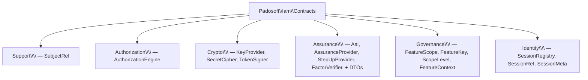

# Reference overview

Every symbol shipped by `padosoft/laravel-iam-contracts` lives under the `Padosoft\Iam\Contracts\`
namespace. This page is the index; each namespace has its own deep page with full signatures, the *why*,
implementors/consumers, and worked examples.

## The namespace map

## Everything at a glance

| Symbol | Kind | Namespace | One line | Page |
| --- | --- | --- | --- | --- |
| `SubjectRef` | `final readonly` (Stringable) | `Support` | `type:id` reference to any PDP subject | [Authorization](/reference/authorization) |
| `AuthorizationEngine` | interface | `Authorization` | the pluggable PDP: `check` + reverse-index | [Authorization](/reference/authorization) |
| `KeyProvider` | interface | `Crypto` | DEK envelope wrap/unwrap/generate | [Crypto](/reference/crypto) |
| `SecretCipher` | interface | `Crypto` | encrypt/decrypt/shred secrets (crypto-shredding) | [Crypto](/reference/crypto) |
| `TokenSigner` | interface | `Crypto` | issue/parse JWT (ES256) + JWKS + rotate | [Crypto](/reference/crypto) |
| `Aal` | enum `string` | `Assurance` | NIST 800-63B assurance level (aal1/2/3) | [Assurance](/reference/assurance) |
| `AssuranceProvider` | interface | `Assurance` | current AAL of a session | [Assurance](/reference/assurance) |
| `StepUpProvider` | interface | `Assurance` | step-up challenge lifecycle | [Assurance](/reference/assurance) |
| `FactorVerifier` | interface | `Assurance` | verify one auth factor (TOTP/passkey) | [Assurance](/reference/assurance) |
| `StepUpPurpose` | `final readonly` | `Assurance` | action + required AAL for a step-up | [Assurance](/reference/assurance) |
| `StepUpChallenge` | `final readonly` | `Assurance` | issued challenge (id, method, expiry) | [Assurance](/reference/assurance) |
| `StepUpResult` | `final readonly` | `Assurance` | step-up outcome (success, resulting AAL) | [Assurance](/reference/assurance) |
| `FeatureScope` | interface | `Governance` | gate/scope a governance feature | [Governance](/reference/governance) |
| `FeatureKey` | enum `string` | `Governance` | which governance feature | [Governance](/reference/governance) |
| `ScopeLevel` | enum `string` | `Governance` | cascade level (layer/app/role/user) | [Governance](/reference/governance) |
| `FeatureContext` | `final readonly` | `Governance` | evaluation context for a feature scope | [Governance](/reference/governance) |
| `SessionRegistry` | interface | `Identity` | revocable server-side sessions | [Identity](/reference/identity) |
| `SessionRef` | `final readonly` (Stringable) | `Identity` | wraps the `sid` binding tokens to a session | [Identity](/reference/identity) |
| `SessionMeta` | `final readonly` | `Identity` | metadata a session opens with | [Identity](/reference/identity) |

## Reading the reference

Each page documents, per symbol:

- **Contract** — the exact PHP signature, copied from `src/`.
- **Why it exists** — the problem it solves in the platform.
- **Who implements it** — the concrete adapter(s), today and planned.
- **Who consumes it** — the packages and code that depend on it.
- **Invariants / fail-closed defaults** — the guarantees an implementation must keep.

::: callout info "Interfaces vs. value objects" icon:info
**Interfaces** (`AuthorizationEngine`, `KeyProvider`, `FeatureScope`, …) are the *ports* you implement.
**Value objects** (`SubjectRef`, `SessionMeta`, the step-up DTOs) are immutable `final readonly` data you
construct and pass. Two enums (`Aal`, `FeatureKey`/`ScopeLevel`) carry tiny pure helpers but no behaviour to
couple to.
:::

## Pages

- [Authorization](/reference/authorization) — `AuthorizationEngine`, `SubjectRef`
- [Crypto](/reference/crypto) — `KeyProvider`, `SecretCipher`, `TokenSigner`
- [Assurance](/reference/assurance) — `Aal` & the step-up family
- [Governance](/reference/governance) — `FeatureScope` & the IGA primitive
- [Identity](/reference/identity) — `SessionRegistry`, `SessionRef`, `SessionMeta`
